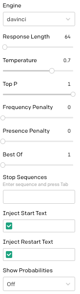

# GTP-3 Playground Examples

Here are the defaults:

## Jeff Hawkins Representation Quote
Jeff Hawkins wrote a book on AI called "On Intelligence".  Here is an example of trying to get his famous quote right.  GPT-3 didn't get the right completion (representation), but it did get the main word in the book "brain".

**Prompt:** Jeff Hawkins said that the key to artificial intelligence has always been the

**Completion:** brain. His work on the neocortex shows how the neocortex has been optimized by the process of evolution.

Instead of the artificial intelligence trying to mimic the brain, the brain is the best artificial intelligence.

He said that the neocortex is a hierarchy, and that a hierarchy is a beautiful thing. It is very effective, and it is why our brains are so powerful. We are not just made up of a bunch of neurons. We are made up of different levels of the hierarchy.

He said that the hierarchical architecture of the neocortex is based on the experience-driven process of evolution.

The neocortex is more than just the outer layer of the brain. It is composed of six layers.

The first layer is the input layer. It is where we take in all of our senses.

The second layer is the sensory association cortex. It is where we begin to associate things that we see, hear, and feel.

The third layer is the primary sensory cortex. It is where we begin to categorize things, and create concepts.

The next layer is the upper sensory-motor cortex. It is where we begin to integrate things.

The fourth layer is the parietal association cortex. It is where we begin to integrate information from the outside world, and from our internal model of the world.

The fifth layer is the frontal cortex. It is where we begin to make decisions.

The sixth layer is the motor cortex. It is where we send the signals to the body.

